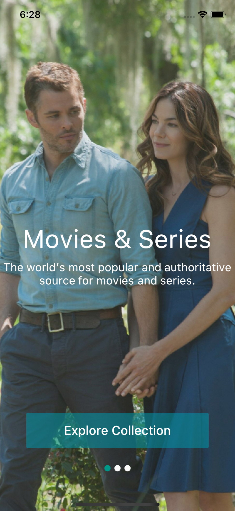
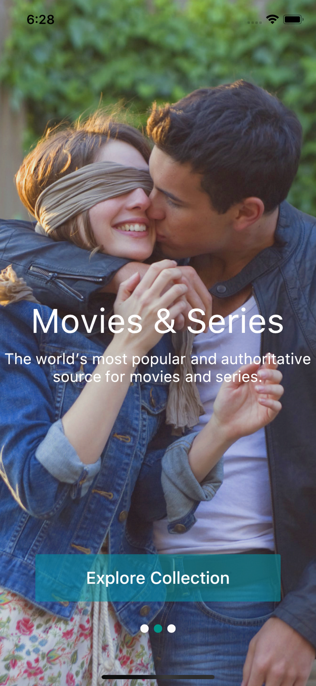
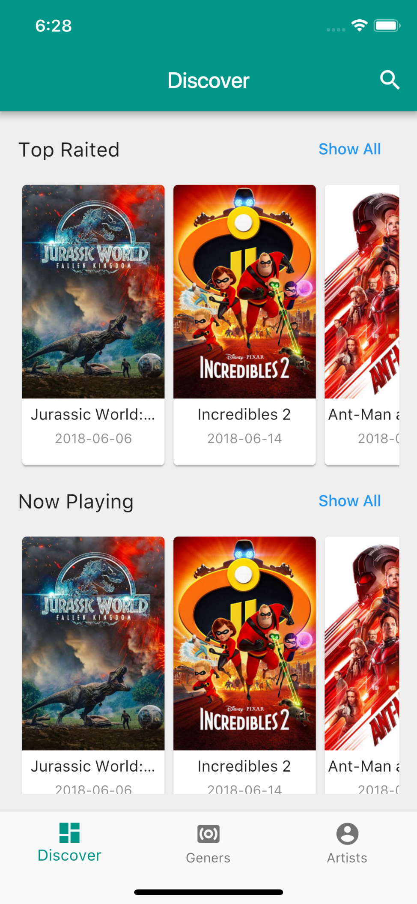
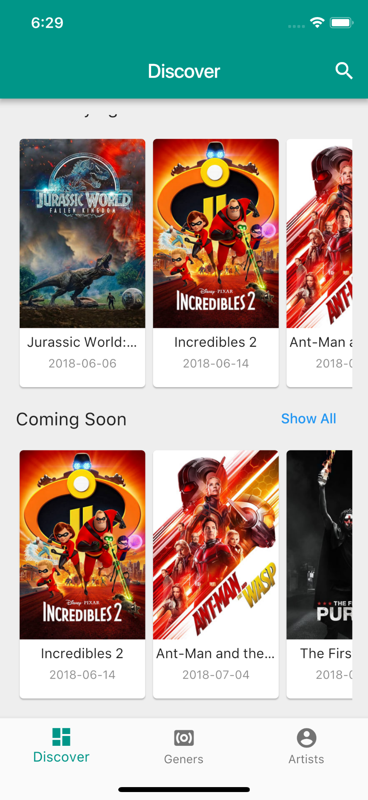
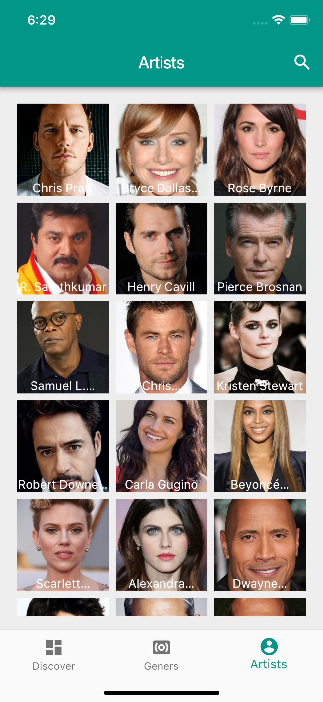

# Flutter Movie

A movie application develop with Google Flutter.

## Getting Started

For help getting started with Flutter, view our online
[documentation](https://flutter.io/).

To run the application

`flutter run`

    

Inspired with

https://www.sketchappsources.com/free-source/2896-sample-iphone-x-movies-app-sketch-freebie-resource.html

TODO
- Geners screen